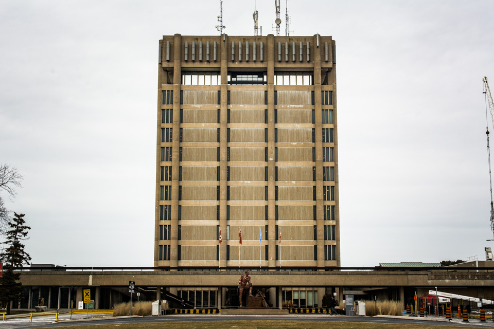
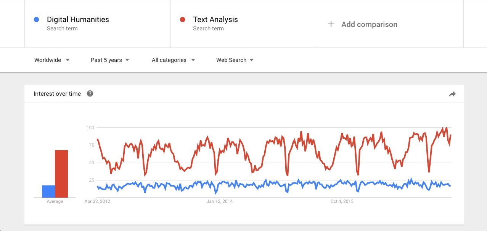

# Welcome to my site 

My name is Aidan Crawley. I am originally from Toronto, but began studying at Brock in 2015. I am in my second year of the Interactive Arts and Sciences program at Brock University, and I intend to complete this undergraduate program with honours. My specific interests in the digital humanities involves unterface design, audio-visual design, and text analysis.  I like to explore website design, sound design and production, and how digital humanities theories apply to these areas. I also enjoy exploring the different software used for design and production in audio-visual projects. A research program I would like to undertake in the field would be to explore how 3D audio and video can be better integrated for a more interactive experience, but also how we can use specific digital tools to bring us away from our screens, while keeping us online. I have applied myself in each of these areas by creating projects, such as coding a website, designing a concept UI, and designing soundscapes for several scenarios. I would like to take what I learn in IASC and apply it to the digital humanities, by either creating digital tools, or doing research to improve the way we can interact through our digital tools.

## Featured Project
##### Discussing Algorithmic Criticisms by Stephen Ramsay

**Abstract**
This project consists of the analysis of section one of Stephen Ramsay’s “Reading Machines”, as well as further research of text analysis tools, and how they are being used in the context of the digital humanities. I argue that digital text analysis, and all other digital tools being used in the humanities is a positive thing. While supporting Ramsay’s work, I also create my own conversation regarding quantity versus quality, and how the combination science and humanities is a positive step forward for both empirical and hermeneutical thinkers. In this blog style research, I started with analysis Ramsay’s work in close detail, making sure I clearly understand Ramsay’s discourse. I decided to write a supporting piece for Ramsay’s work, as well as the topic he discusses. This involved some summary and reflection on his research into how digital humanities practices are perceived by traditional humanities scholars. Next, I compare Ramsay’s ideas of other digital humanities scholars such as Bethany Nowviskie, and her work “neatline & visualization as interpretation”, and Jennifer London’s Re-imagining the Cambridge School in the Age of Digital Humanities. Each provides support for my argument of support for digital text analysis. In my concluding remarks, I found that I was not only in agreement with Ramsay, but I could fully understand what he wanted to see in the digital humanities. I feel that my own conclusions are very similar to Ramsay’s in the sense I agree with support for the combination of theory and application, and science and humanities. 

My [Collaborative Project](CollaborativeProject.MD)

My academic blog [*Discussing Algorithmic Criticisms by Stephen Ramsay*](blog.md)

My [Research Presentation](reveal/index.html) about the Gameboy Printer and Camera.
 
