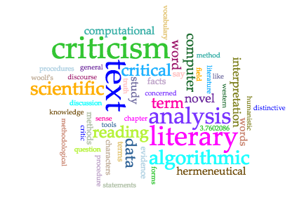

### Discussing Algorithmic Criticisms by Stephen Ramsay

Digital text analysis and visual representation has become a prominent form of literary analysis, and can provide some scholars, teachers,
and students a deeper understanding of literary texts. These new ways of analysis, such as visual and graphical quantitative formats, 
can expand our understanding of a text, or create a whole new meaning all together. In Reading Machines by Stephen Ramsay, section 1, 
An Algorithmic Criticism discusses how these digital tools are shaping the way critics formulate interpretations about literary texts. 
Ramsay also discusses how some literary critics don’t feel these tools have a place in the humanities. Two central themes of Algorithmic 
Criticism are quantitative versus qualitative information and literary text analysis. These themes provide background for my supporting 
discussion about digital text analysis and digital Interpretation in the humanities. 

Human interpretation is ones own analysis, assessment, and conclusion of anything the body can interact with through its senses. In the 
21st century, we use our technology as an extension of our senses both physically and mentally, more so than any other time in 
history. This extension of digital technology is widely accepted in the science and business world, but seems to fall short in the 
humanities fields. Ramsay explains that “It is not difficult to see why a contemporary criticism temperamentally and philosophically at
peace with intuition and serendipity would choose to ignore the corrective tendencies of the computer against the deficiencies of 
"human reading:' Text analysis arises to assist the critic, but only if the critic agrees to operate within the regime of scientific 
methodology with its "refutations" of hypotheses.” (Ramsay, 2011).  From this, it can be inferred that certain critics see digital text 
analysis as limiting, and would argue for more traditional ways of text analysis in order keep the humanities strictly human. The 
corrective tendencies of the computer (referred to in the quote above), is exactly what Algorithmic Criticism is about. 
Interpretation of the humanities is largely subjective, if not completely. So how can an objective-based machine possibly provide the 
necessary qualitative data required for accepted interpretation? A simple answer is that it can’t. The purpose of computers can be 
largely misinterpreted when giving them a place in literary text analysis and the humanities in general. 

There is still much to be said about human interpretation. In some cases, computers can’t compete with our ability to correlate ideas 
and information through empirical inquiry. Ramsay uses Miriam Wallace’s research of the 1931 novel The Waves by Virginia Woolf as a good 
example of this. Wallace suggests that, “Focusing on the narrative construction of subjectivity reveals the pertinence of The Waves for 
current feminist reconfigurations of the feminine subject. This focus links the novel's visionary limitations to the historic moment of 
Modernism” (Wallace, 2000)(2011). This interpretation is was reached through pure observation and analysis of the text, but also by going
outside of the novels subject area and looking at intangible yet impotant concepts like feminism. This theory is one that cannot likley  be drawn from digital text analysis due to the complexity of the correlating ideas involved. While this theory is extremely interesting and thought provoking, it does not provide a concrete answer or solution to anything. But as Ramsay puts it, “We are not trying to solve Woolf. We are trying to ensure that discussion of The Waves continues”. (Ramsay, 2011)  This is the key to understanding the misinterpretation of computers in the humanities. They are not supposed be used for providing answers, but rather for assisting in the continuation and development of literary criticisms, text analysis, and humanities conversations of all types. 

In order to realize the true potential of machines in the humanities, we have to use computers to help us visualize our interpretations,
concepts and theories. The first example of this is a tool called Voyant. This online tool is designed to analyze text files or text 
pasted from a computers clipboard. Once the text is entered, the user can visualize the text in the forms of graphs, plots, and other 
visual form such as the Cirrus(pictured below). Voyant is useful for visualizing the most frequent words, or common phrases within one or 
multiple texts. As well, every analysis tool within voyant can be exported into code, or as an image. A second tool that is useful for 
interpretation is Neatline. Neatline is a geospatial-based tool that can create interactive maps and stories through its open source 
software. Neatline was created with the idea that visualization in the humanities is about the process, rather than the result 
(Nowviskie, 2011).  

#####This visual above is a Cirrus of the most used words in Algorithmic Criticism

By the end of Algorithmic Criticisms, it seems that Ramsay is welcoming of digital text analysis. He explains that the digital criticism 
needs a drastic change, not just by design, but how the humanities community sees it. While the purpose of digital criticism may not 
always be clear, it can play a very important role in discovering new ways to interpret textual information.  In order to gain the full 
potential of the digital humanities, we must use our machines to provide us with quantitative information that can create qualitative
criticisms that can lead to new and exciting interpretations. 
	

Works Cited:

    Nowviskie, Bethany. "Neatline & visualization as interpretation." Bethany Nowviskie. N.p., 02 Nov. 2014. Web. 10 Mar. 2017.

    Ramsay, Stephen. Reading machines: toward an algorithmic criticism. Urbana, IL: U of Illinois Press, 2012. Print.

    “Voyant Tools.” N.p., n.d. Web. 10 Mar. 2017.

